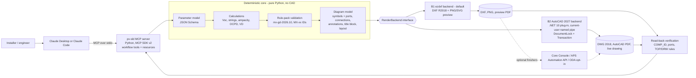

# ADR-0001: Claude ↔ AutoCAD Integration Approach

| Field | Value |
|---|---|
| Status | **Accepted** |
| Decision date | 2026-10-05 |
| Phase / stage | Phase 1, Stage 1.4 |
| Deciders | edu3250 (project owner) |
| Supersedes | — |
| Vault original | `wiki/decisions/ADR-0001 Integration Approach.md` |

> [!NOTE]
> This file mirrors the ADR kept in the author's local Obsidian research vault (not part of this repository). A citation such as "(Source: AutoCAD API Landscape)" names a vault note. The vault holds the full source notes, with URLs, access dates (2026-10-04/05) and confidence ratings. A selection of primary public sources appears under [Key public sources](#key-public-sources) at the end. For a condensed overview of the research, see [`docs/research/phase-1-summary.md`](../research/phase-1-summary.md).

> [!NOTE]
> **Decision in one paragraph.**
> Build a **layered hybrid**. A Python MCP server on **stdio** exposes a few workflow-level tools to Claude. Behind it, a **deterministic core** turns the PV parameter model into calculations, a versioned Mexican rule-pack validation (`mx-gd-2026.10`, keyed to the MX-xx checklist IDs) and a **backend-neutral diagram model**. Pluggable **render backends** then materialize that model. The **ezdxf DXF R2018 backend comes first**: headless, licence-free, golden-file tested in CI, and it returns a PNG preview to Claude. An **AutoCAD 2027 .NET 10 plug-in backend** over a current-user named pipe comes second, for native DWG, AutoCAD PDF plotting and live editing. COM is only a throwaway measurement spike. Core Console and the APS Automation API are optional finishers. Claude elicits, validates and explains. It never draws raw geometry and gets no arbitrary-code tool.

## Status

- **Accepted** on 2026-10-05 (Phase 1, Stage 1.4). Vault status: `active`.
- **Gate:** implementation depends on the Phase 2 spikes ([Phase 2 validation plan](#phase-2-validation-plan)). If a [reversal trigger](#reversal-triggers) fires, a new ADR supersedes this one; this one is not edited in place.
- **Deciders:** edu3250 (project owner); synthesis of research reports R1–R6 (Phase 1 research wave, 2026-10-04/05).
- **Vault original:** `wiki/decisions/ADR-0001 Integration Approach.md` in the project's Obsidian research vault.

## Context

**Problem.** How should Claude, via MCP, reach AutoCAD to produce photovoltaic single-line diagrams (SLDs) that Mexican reviewers (CFE, UVIE, inspection units) accept?

**Facts that frame the decision (as of 2026-10):**

- **Nothing official to plug into.** Autodesk's AutoCAD MCP server is a Tech Preview inside AutoCAD 2027. Its only client is Autodesk Assistant, and it has no tools to draw, insert blocks, fill attributes or plot (Source: AutoCAD and Civil 3D MCP Server Documentation). Autodesk has no MCP server for external AutoCAD control, Design Automation, DWG files or AutoCAD Electrical (Source: Autodesk MCP Servers).
- **How external code gets in.** External processes reach AutoCAD only through COM, or through a channel that an in-process plug-in opens. Autodesk's own Revit MCP pairs a stdio executable with an in-app add-in (Source: AutoCAD API Landscape, Revit Public MCP Server Documentation).
- **Target platform.** AutoCAD 2027 (R26.0, released 2026-03-25; 2027.1 on 2026-08-04) runs .NET 10. AutoCAD 2025 and 2026 shipped on .NET 8 (Source: AutoCAD 2027 Managed .NET and ObjectARX Compatibility Tables). Microsoft support for .NET 8 ends on 2026-11-10, so updates 2025.1.4 and 2026.1.2 move those releases' dependencies to .NET 10; whether unchanged net8.0 plug-ins still load on them is unverified (Source: AutoCAD .NET API, Autodesk Support - .NET 10 Transition for AutoCAD Products). AutoCAD 2027 is registered on the project workstation as `AutoCAD.Application.26` (Source: R6 ezdxf Probe Experiment 2026-10-04).
- **Mixed audience.** Users run full AutoCAD, AutoCAD LT (no COM or .NET; AutoLISP only since LT 2024 on Windows), other DWG-compatible CAD, or no CAD at all (Source: AutoCAD 2027 Developer Help - Supported Programming Interfaces, Programmatic DWG-DXF Generation Paths).
- **Regulation prescribes content, not format.** No official SLD template, sheet size, file format, layer standard or title-block layout exists. Electronic drawings are allowed (PEC 7.2 III.1). The consolidated checklist has 77 items (MX-A01…MX-I07), and 71 of them (92 %) can be checked by machine. The UVIE ≥ 100 kW detail level also satisfies CFE and the inspection units (Source: Mexican SLD Submission Requirements).
- **Regulation is moving.** NOM-001-SEDE-2012 is still in force, with a modification scheduled for 2026. The distributed-generation (GD) limit rose to < 0.7 MW under the 2025 Ley del Sector Eléctrico (LSE), and a GD-specific DACG is still pending (Source: NOM-001-SEDE-2012, Mexican Energy Reform 2025).
- **Community.** More than 100 community AutoCAD MCP repositories exist. None produces PV SLDs or targets CFE/NOM (Source: Community AutoCAD MCP Servers Comparison).
- **Claude host limits.**
  - Claude Desktop: about 150k characters per tool result and 240 s per call.
  - Claude Code: 25k-token output cap and a 30 s startup timeout.
  (Source: Claude Connector Building Docs, Claude Code MCP Documentation)

### Where the research disagreed, and how it is reconciled

| Camp | Position | Strongest argument |
|---|---|---|
| R1 (Autodesk), R2 (MCP), R3 (community) | In-process AutoCAD .NET 10 plug-in behind an out-of-process stdio MCP server, over a current-user named pipe (DocumentLock + Transaction). ezdxf serves as the headless/CI lane | Atomic transactions and rollback; full API; TrustedDWG and AutoCAD plotting; used by the most rigorous community servers and by Autodesk's Revit MCP (Source: AutoCAD MCP Integration Architectures, Bridging MCP to Desktop Applications, AutoCAD API Landscape) |
| R6 (CAD generation) | "Generate, don't drive": ezdxf headless DXF is the core. AutoCAD is only an optional finisher (DWG save, PDF plot, live open). The .NET plug-in should not be the first deliverable | Serves LT and no-CAD users; licence-free; cross-platform CI; byte-deterministic output; millisecond generation (Source: Programmatic DWG-DXF Generation Paths, Headless CAD Generation) |

**All six reports agree that:**
- the parameter model is the source of truth;
- calculations and validation are deterministic Python outside the LLM;
- Claude elicits, validates and explains, and never draws raw geometry;
- there are no arbitrary-code tools;
- the Mexican rule pack is versioned and keyed to the MX-xx IDs.

(Source: PV SLD Parameter Model, PV SLD Validation Rules, MCP Server Design Patterns)

**Reconciliation.** The camps disagree on **order and default**, not on components. Both already describe a backend-neutral domain layer:
- R1: parameter model → drawing plan → API adapter (Source: AutoCAD API Landscape).
- R2: a `DrawingBackend` protocol with a DXF implementation and an AutoCAD-bridge implementation (Source: MCP Server Design Patterns).
- R6: generation kept separate from finishing (Source: Headless CAD Generation).

This ADR adopts both renderers behind one interface and sets their order from the decision drivers:
1. **ezdxf first.** It unblocks every user, CI and Claude's visual self-check at no licence cost.
2. **.NET plug-in second.** Native DWG, AutoCAD-quality PDF and live editing matter only to full-AutoCAD users, and they cost a C# toolchain, signing and per-release builds.

## Decision drivers

| ID | Driver | Evidence |
|---|---|---|
| D1 | No usable official integration: the AutoCAD MCP server is Assistant-only and has no creation tools | (Source: AutoCAD and Civil 3D MCP Server Documentation, Autodesk MCP Servers) |
| D2 | External access to AutoCAD is COM, or a channel opened by an in-process plug-in. Autodesk's Revit MCP uses stdio exe + add-in | (Source: AutoCAD API Landscape, Revit Public MCP Server Documentation) |
| D3 | The audience includes AutoCAD LT and no-CAD users. LT has no COM and no .NET | (Source: AutoCAD 2027 Developer Help - Supported Programming Interfaces, Programmatic DWG-DXF Generation Paths) |
| D4 | Testability: CI must guard LLM-driven output. The ezdxf probe gave byte-identical files with fixed metadata, 0 audit errors, and ≈43 ms per small sheet. GUI automation cannot run on hosted CI | (Source: R6 ezdxf Probe Experiment 2026-10-04, CAD Output Testing Strategies, ezdxf Document Metadata Docs and Source (Fixed Metadata Option)) |
| D5 | Regulation fixes content (77 MX items, 71 of them (92 %) machine-checkable), not the file format; electronic drawings are allowed | (Source: Mexican SLD Submission Requirements) |
| D6 | Division of labour: Claude fills and explains a spec; code computes and draws; few workflow-shaped tools; host budgets (240 s, ≈150k chars, 25k tokens). Autodesk itself says AI-generated geometry is not yet dependable | (Source: MCP Server Design Patterns, Anthropic Engineering - Writing Effective Tools for Agents, Claude Connector Building Docs, Claude Code MCP Documentation, Autodesk Fusion MCP Server Documentation) |
| D7 | Licensing: local bring-your-own-licence use is consistent with Single User terms, and batch/background runs are carved out of the concurrency count. Service-bureau use is prohibited; hosted generation must use APS | (Source: AutoCAD Licensing for Automation, Autodesk Terms of Use - Offering Types and Acceptable Use (2026)) |
| D8 | No free, commercially clean non-Autodesk DWG 2018 writer exists. The ODA converter is non-commercial for non-members; LibreDWG is GPLv3 and reliable only up to R2004 | (Source: Programmatic DWG-DXF Generation Paths, ODA File Converter Page and ODA FAQ, LibreDWG Repository, GNU Page and dxf2dwg Manual) |
| D9 | Security: `execute_lisp`/`send_code` escape hatches are common in community servers, and two C# plug-ins listen on all interfaces without auth. A current-user named pipe is local and per-user by construction | (Source: AutoCAD MCP Integration Architectures, Community AutoCAD MCP Servers Comparison, Microsoft Learn - .NET Named Pipes for IPC, MCP Security) |
| D10 | Platform churn: in-process code is rebuilt per AutoCAD .NET runtime (2027 = .NET 10; 2025/2026 base = .NET 8, with updates 2025.1.4/2026.1.2 moving to .NET 10 dependencies) | (Source: AutoCAD .NET API, AutoCAD 2027 Managed .NET and ObjectARX Compatibility Tables, Autodesk Support - .NET 10 Transition for AutoCAD Products) |
| D11 | Regulatory volatility: the NOM revision is scheduled for 2026 and the GD DACG is pending. Rules must change as data, not code | (Source: NOM-001-SEDE-2012, Mexican Energy Reform 2025) |

## Options considered

| # | Option | Pros | Cons | Verdict |
|---|---|---|---|---|
| O1 | **Autodesk official AutoCAD MCP server** (Tech Preview, inside Autodesk Assistant) | Official; ships in AutoCAD 2027; useful for template and standards QA | Only client is Autodesk Assistant. Seven documented tools; in AutoCAD only the read, analysis, navigation and compliance tools are enabled (object-update and style tools are Civil 3D only), plus layer and system-variable management since 2026-09. Cannot draw, insert blocks, fill attributes or plot. Transport undocumented (Source: AutoCAD and Civil 3D MCP Server Documentation) | **Rejected** as the integration path. Optional manual QA aid; watch item (trigger T1) |
| O2 | **Fork a community server** (shortlist: U-C4N-Autocad-MCP, beiming183-cloud-AutoCAD-MCP, puran-water-autocad-mcp) | Working code. U-C4N: attributed blocks with named ports, graph read-back, ≈4,990 tests. beiming183: safe transport (signed .NET worker, current-user pipe, DocumentLock + Transaction). puran-water: small, readable, golden-DXF tests | None produces SLDs or knows CFE/NOM. U-C4N is COM-only with 247 tools. beiming183 has no verified AutoCAD 2027 / .NET 10 build. puran-water's keystroke file IPC is LT-oriented and fragile, with no push since 2026-02. Five notable repos are unlicensed (Source: Community AutoCAD MCP Servers Comparison, U-C4N AutoCAD MCP Source Review Benchmark (2026-09)) | **Rejected as a base; borrow patterns** from MIT/Apache-2.0 code only: ports, graph read-back and backend-parity test (U-C4N); pipe transport and safety (beiming183); golden-DXF tests (puran-water); units contract and output sandbox (Slacker-LLC-autocad-mcp) |
| O3 | **Live COM from Python** (pywin32/comtypes, `AutoCAD.Application.26`) | No install inside AutoCAD; pure Python; fastest prototype | One RPC per call. `RPC_E_CALL_REJECTED` while AutoCAD is busy needs retries. STA apartment rules clash with SDK worker threads. No transactions. No LT. Low determinism (Source: Kean Walmsley - Handling COM Calls Rejected by AutoCAD (2010), Microsoft Learn - COM Single-Threaded Apartments, Python COM Interop Sources for AutoCAD (pywin32, comtypes, imessagefilter)) | **Spike only** (S2 baseline), then discarded. Kept as a fallback only if trigger T4 fires |
| O4 | **In-process AutoCAD .NET 10 plug-in + out-of-process stdio MCP server over a current-user named pipe** | Full API under DocumentLock + Transaction (atomic, real rollback). One message per high-level operation. TrustedDWG and AutoCAD plotting. Live editing. Pattern of beiming183, bimwright and debug23win and of Autodesk's Revit MCP. Core-safe code also runs in Core Console and APS (Source: AutoCAD MCP Integration Architectures, ADN-DevTech AutoCAD Agent Skills and DA Samples) | Second language (C#) with per-release .NET targets. SECURELOAD/signing and an installer. Full AutoCAD on Windows only. Tests need a running, licensed AutoCAD (Source: debug23win CAD MCP Capabilities and Implementation Comparison, AutoCAD 2027 Managed .NET and ObjectARX Compatibility Tables) | **Adopted as backend B2** (second): native DWG, PDF plotting, live editing |
| O5 | **AutoLISP file-IPC bridge** (AutoCAD LT 2024+) | The only live route into LT; no compiled plug-in | Fragile keystroke triggering; ≈0.25–1 s polling per call; world-writable IPC folder; habitual `execute_lisp`; OSNAP side effects on `(command …)` (Source: AutoCAD MCP Integration Architectures, Autodesk Support - AutoLISP in AutoCAD LT) | **Deferred.** LT users get DXF plus a preview and save as DWG themselves (trigger T5) |
| O6 | **ezdxf headless DXF R2018 generation** | MIT; no licence; any OS. Blocks with ATTDEFs, XDATA ports, layers, paperspace, audit, PNG/SVG/PDF rendering. Byte-identical golden files. ≈43 ms per small sheet; ≈0.29 s for 300 attributed inserts (Source: R6 ezdxf Probe Experiment 2026-10-04, ezdxf PyPI Page and GitHub Repository) | Writes DXF, not DWG. No AutoCAD plot engine (no CTB); previews approximate MTEXT and fonts. Layout and wire routing are our own code. Single-maintainer library (Source: ezdxf) | **Adopted as backend B1** (first, default) |
| O7 | **DWG through ODA File Converter / ODA SDK, or LibreDWG** | DWG without AutoCAD; the ODA converter is free and cross-platform | ODA converter is non-commercial for non-members. ODA membership costs USD 3,000 in the first year (USD 2,250/yr recurring) or more. Output is not TrustedDWG. LibreDWG is GPLv3 and reliable only up to R2004 (Source: ODA File Converter Page and ODA FAQ, ODA Pricing and MCP Servers Pages (2026-10), LibreDWG Repository, GNU Page and dxf2dwg Manual) | **ODA: opt-in only** (user installs it and accepts its licence). **LibreDWG: rejected** for output |
| O8 | **AutoCAD Core Console batch** (`accoreconsole.exe`) | Full engine, headless. Produces TrustedDWG 2018 and an AutoCAD-plotted PDF from a script. Starts in 1–2 s. Runs Core-safe .NET and LISP (Source: AutoCAD Core Console) | Needs a licensed full AutoCAD running in the licensed user's session, and fails silently otherwise. Windows only. Historically described as not officially supported (Source: AcCoreConsole Licensing Reports (Forums and fdestech Guide)) | **Optional local finisher** (DXF → DWG 2018 + PDF), validated in S4 |
| O9 | **APS Automation API** (Design Automation for AutoCAD) | No local licence; cloud Core Console up to `Autodesk.AutoCAD+26_0`; the only licensing path for a hosted service | Needs an APS account and credentials. Pricing: 5 free AutoCAD processing hours/month, then 1 Flex token or USD 3 per 12 min (≈ USD 15/h). US-East only. No AutoCAD Electrical. Tens of seconds per job (Source: Design Automation API for AutoCAD, APS Business Model Evolution and API Rate Chart (2025-12), APS Automation API Developer Guide v3) | **Optional, later** cloud finisher; mandatory if a hosted variant is ever built (trigger T7) |
| O10 | **Chosen: layered hybrid.** Deterministic Python core + pluggable render backends (B1 ezdxf first, B2 .NET plug-in second) + optional finishers | Serves every user. Full pipeline in CI without AutoCAD. Claude self-checks via PNG. AutoCAD users later get native DWG, plotting and live editing without new tools. Each layer is testable in isolation | Two renderers to keep in parity. More up-front design: diagram model, backend interface, symbol manifest | **Adopted** |

## Decision

1. **Three layers, one contract.**
   - **L1, MCP server.**
     - Python with the official MCP Python SDK v2 (`mcp>=2.3,<3`, class `MCPServer`).
     - stdio transport only; logs to stderr only; launched by absolute path with `PYTHONUTF8=1`.
     - Exposes workflow-level tools and resources (table below).
     - Never runs inside AutoCAD.
     (Source: MCP Python SDK v2 Docs and Repository, Bridging MCP to Desktop Applications)
   - **L2, deterministic core** (pure Python, no CAD dependency). The pipeline runs in four steps:
     1. **Parameter model:** Pydantic, published as JSON Schema 2020-12, with `schema_version`.
     2. **Calculations:** temperature-corrected Voc, string limits, ampacity, OCPD, voltage drop, 120 % busbar check.
     3. **Validation:** the rule pack `mx-gd-2026.10` runs. Each rule carries a rule ID, its MX-xx IDs, a severity, a Spanish message and a NOM-001-SEDE-2012 citation; tables are stored as data keyed by NOM edition.
     4. **Diagram model:** a backend-neutral description of the sheet (see point 2).
     (Source: PV SLD Parameter Model, PV SLD Validation Rules, Mexican SLD Submission Requirements)
   - **L3, render backends** behind one `RenderBackend` interface, plus finishers.
2. **The diagram model carries the layout.** The core computes everything on the sheet:
   - symbol placement on a fixed port grid;
   - wire routes;
   - annotations and tables;
   - title block and revision block;
   - the layer assignment.

   All of it is expressed in sheet millimetres, so backends are thin materializers. This keeps the two renderers in parity and makes the comparison testable. Flow runs left to right, sheets are A3 by default, and the layer standard follows SLD Drafting Conventions.
3. **Backend order.**
   - **B1, ezdxf DXF R2018 (default).** The only backend required for v1. It returns DXF plus a PNG/SVG preview, and optionally an ezdxf PDF marked as a preview.
   - **B2, AutoCAD 2027 .NET 10 plug-in** over a current-user named pipe. Provides native DWG 2018, AutoCAD PDF plotting and live editing (open, zoom to a component, update attributes).
   - **Finishers:**
     - Core Console (local, if a licensed full AutoCAD is present);
     - APS Automation API (opt-in, with the user's credentials);
     - ODA File Converter (opt-in, user-installed).
   - **COM:** S2 measurement spike only. **AutoLISP/LT bridge:** deferred.
4. **Claude's role.** Claude:
   - elicits missing inputs (RPU, cédula profesional, T_min source, compensation regime);
   - proposes string configurations;
   - calls validation before generation;
   - explains findings in Spanish.

   Equipment data comes from datasheets or a curated catalogue, never from model memory. Claude never draws geometry. There are no primitive drawing tools and no code-execution tools (`execute_lisp`, `send_code`, `send_command`) (Source: MCP Server Design Patterns, PV Electrical Symbology).
5. **Verification by read-back.** Every generated drawing is reloaded and checked:
   - block attributes are matched by `COMP_ID`;
   - ports are checked for connectivity;
   - layers are checked;
   - the post-drawing TOP/DRW rules run (DRW-008 round-trip equality).

   A successful tool return is not evidence (Source: PV SLD Validation Rules, AI4CharityPL PATTERN - Wrapping a Thick Desktop Application in MCP).
6. **Symbol library as code.** A versioned manifest defines block geometry, attribute tags and ports. The build emits a master library drawing that both backends insert, so block definitions are identical. Data lives in three places:
   - **Ports:** block-record XDATA.
   - **Component identity:** a hidden `COMP_ID` attribute, readable by any CAD tool, plus per-INSERT XDATA.
   - **Spanish text:** attribute values, never tags.

   The block-name prefix and the XDATA AppID are fixed in S1, because the vault notes disagree (`PVSLD_` vs `MXPV_`) (Source: Block-Based Symbol Libraries, PV Electrical Symbology).
7. **Default detail level:** UVIE ≥ 100 kW, which also satisfies CFE and the inspection units (Source: Mexican SLD Submission Requirements).
8. **Versions.** AutoCAD 2027 (`net10.0`) first. A `net8.0` build for 2025/2026 comes only on demand and after the .NET-10-aligned updates are verified. AutoCAD 2024 and earlier are out of scope (Source: AutoCAD API Landscape).
9. **Distribution.** Three stages:
   - a repo `.mcp.json` for Claude Code;
   - a JSON snippet for Claude Desktop;
   - an MCPB bundle later.

   The B2 plug-in ships as a signed `.bundle` in a trusted path (Source: Configuring MCP Servers in Claude, AutoCAD .NET API).

### Initial MCP surface

| Name | Kind | Behaviour | Notes |
|---|---|---|---|
| `validate_pv_design` | tool, read-only | Validates a spec against `mx-gd-2026.10`. Returns findings (rule ID, MX IDs, severity, Spanish message, NOM citation) and the derived values | Server instructions: "validate first" |
| `generate_single_line_diagram` | tool, idempotent, non-destructive | Re-validates, builds the diagram model and renders it with the selected backend (`auto` → B1 unless B2 is requested and reachable). Returns `drawing_id`, file paths, a compact summary and a PNG preview | One call per sheet. Output-directory sandbox. Explicit `overwrite` |
| `export_drawing` | tool | Produces DWG 2018 and/or PDF for a `drawing_id` through the best available finisher | `anthropic/requiresUserInteraction` when overwriting |
| `get_diagram_summary` | tool, read-only | Reads a drawing back by `COMP_ID` and reports drift from the model | Later stage |
| `pvsld://schema/pv-system-spec` | resource | JSON Schema of the parameter model | |
| `pvsld://rulepack/mx-gd-2026.10` | resource | Rule catalogue with citations | |
| `pvsld://symbols` | resource | Symbol catalogue (blocks, ports, attribute tags) | |

These names supersede the provisional `validate_project` / `generate_sld` proposed in the first draft of PV SLD Parameter Model and PV SLD Validation Rules (both renamed on 2026-10-05). Tool shape follows MCP Server Design Patterns: structured output, errors that tell Claude what to fix, honest annotations, opaque handles. The handles are needed because the 2026-07-28 MCP specification is stateless.

### B2 bridge contract

- **Assembly split.**
  - A **Core-safe render assembly** references only `AutoCAD.NET.Core` and `AutoCAD.NET.Model`, with `ExcludeAssets=runtime`. It materializes the diagram model inside a `Transaction`.
  - A thin **desktop host assembly** owns the pipe listener, the job queue, main-thread marshalling and `DocumentLock`.
  - Core Console can NETLOAD the render assembly, and it can later be packaged for APS (Source: AutoCAD .NET API, ADN-DevTech AutoCAD Agent Skills and DA Samples).
- **Channel.** Named pipe with `PipeOptions.CurrentUserOnly`, newline-delimited JSON-RPC (MCP stdio framing), and a secret generated at each start (Source: Microsoft Learn - .NET Named Pipes for IPC, MCP Spec 2026-07-28 Versioning and Transports Pages).
- **Allowlisted operations only:** `ping`, `render_diagram`, `read_back`, `save_as_dwg`, `plot_pdf`, `zoom_to`. No code execution.
- **Execution.** One job at a time. A modal dialog or active command returns an actionable "busy" error. Timeouts stay within host budgets, and longer work returns a job handle (Source: Bridging MCP to Desktop Applications).

## Architecture

The model reaches the drawing in one direction: parameter model → rules → diagram model → backend. Read-back closes the loop so the same rules can check the drawing.

## Consequences

**Positive**
- Every user gets a valid, auditable DXF with a preview, with no AutoCAD required. This includes LT users and users of other CAD tools.
- The whole pipeline runs on hosted CI (Windows and Linux) on every pull request: model → rules → DXF → read-back → golden files (Source: CAD Output Testing Strategies).
- Claude gets a visual self-check loop and compact structured results that fit host limits.
- Regulatory change becomes a rule-pack or data change, not an architecture change.
- AutoCAD users later get TrustedDWG output, AutoCAD-plotted PDF and live editing, with no change to tools or core.
- Licensing stays clean: no Autodesk binaries are redistributed, and the core needs no licence.
- Backend independence leaves room to adopt an official Autodesk MCP, ODA MCP servers or APS later.

**Negative**
- Two renderers must stay in parity, and the symbol library must work in both.
- The project owns a layout and routing engine, because ezdxf is not a CAD engine.
- Until B2 or a finisher exists, the output is DXF. DWG needs the user's AutoCAD (or LT SAVEAS); DWG written by non-Autodesk tools triggers the "not saved by Autodesk" notice (Source: DWG File Format).
- ezdxf PNG/PDF output approximates MTEXT and fonts, and its acceptability to CFE/UVIE is unverified.
- Regeneration overwrites manual edits. Reading back user edits is an open product question.
- B2 brings a C# toolchain, code signing and per-release builds.
- LT users get no live integration in v1.

## Risks and mitigations

| Risk | Mitigation |
|---|---|
| Renderers drift apart | Layout is computed once in the core and both backends share one symbol library. A parity test compares read-back inventories (blocks, attributes, layers, port connectivity) of B1 DXF and B2 DWG for the same spec. A capability-key test follows U-C4N's precedent (Source: AutoCAD MCP Integration Architectures) |
| Layout engine grows complex | One template per topology (start with `bt_string_residential_v1`); fixed port grid; left-to-right flow (Source: SLD Drafting Conventions, PV System Topologies) |
| Preview/PDF fidelity (MTEXT, fonts, Spanish accents) | Pin fonts and rendering dependencies; test accented text; use the AutoCAD plot engine through a finisher when available (Source: ezdxf) |
| LLM invents or mistypes equipment data | Catalogue entries keyed by `id` from datasheets; schema and rule-pack checks; server instructions "validate first"; errors name the rule and the fix |
| AutoCAD busy states, threading, hangs | Serialized queue; marshal to the main thread; DocumentLock + Transaction; timeouts and "busy" errors |
| Local attack surface | stdio only; current-user pipe plus secret plus allowlist; no code-execution tool; output-directory sandbox; confirmation on overwrite; drawing text treated as data (Source: MCP Security) |
| .NET runtime churn | `net10.0` for 2027 first; verify 2025.1.4 / 2026.1.2 behaviour before claiming 2025/2026 support (Source: Autodesk Support - .NET 10 Transition for AutoCAD Products) |
| Core Console licensing fails silently | Check exit code, output existence and timeout; report an explicit error (Source: AcCoreConsole Licensing Reports (Forums and fdestech Guide)) |
| Regulatory gaps: 0.5–0.7 MW band unclassified, pending GD DACG, NOM revision | Versioned rule pack keyed by edition; explicit "no Manual class" flag; scheme lookup stored as data (Source: Mexican Energy Reform 2025) |
| Host limits (240 s, ≈150k chars, 25k tokens) | Compact results with file paths; downscaled PNG; job handles for long work (Source: Claude Connector Building Docs) |
| Professional liability | Every drawing carries its validation report and is marked as a draft until the responsible engineer (cédula profesional) reviews and signs it (Source: Mexican SLD Submission Requirements, AutoCAD Licensing for Automation) |

## Licensing posture

- **Project code:** MIT. Core dependencies are permissive; ezdxf is MIT.
- **Bring your own licence, local only.** B2 and Core Console run on the user's machine, with the user's own AutoCAD, for the user's own projects. This is consistent with Single User terms, and batch/background activity is carved out of the concurrency count. The project references Autodesk NuGet assemblies with `ExcludeAssets=runtime` and never redistributes Autodesk binaries (Source: AutoCAD Licensing for Automation, ADN-DevTech AutoCAD Agent Skills and DA Samples).
- **No service bureau.** A hosted variant must never run desktop AutoCAD or Core Console for third parties. It must use the APS Automation API (paid per use) or the licence-free ezdxf core (Source: Autodesk Terms of Use - Offering Types and Acceptable Use (2026)).
- **ODA:** opt-in only. The user installs it and accepts its licence, which is non-commercial for non-members (Source: ODA File Converter Page and ODA FAQ).
- **Community code:** reuse MIT/Apache-2.0 code only, with attribution.
  - Do not copy GPL/AGPL code (LibreDWG, dimitrovakulenko-dwg-mcp-server, Igualguana-AUTOCAD-ELECTRICAL-MCP); GPL tools may run only as separate, user-installed verification tools.
  - Do not reuse unlicensed repositories (Source: Community AutoCAD MCP Servers Comparison).
- **Output responsibility.** Autodesk's terms make users responsible for verifying output. Mexican practice requires a responsible engineer's signature at the UVIE ≥ 100 kW level. The tool produces drafts, not certified documents. This is not legal advice.

## Phase 2 validation plan

Phase 2 proves the decision with trial-and-error spikes. All thresholds below are **proposed targets** that the owner confirms when Phase 2 is planned. Every spike records its measurements in the vault.

| Spike | Goal | Method | Success criteria (measurable) |
|---|---|---|---|
| **S1** ezdxf minimal PV SLD | Prove B1 and the core shape end to end | Render the 7.70 kWp residential example from PV SLD Parameter Model (2 strings × 7 × 550 W, one 6 kW 220 V inverter, ITM-1, CC-1, ITM-P, bidirectional MF, PI, grounding, A3 title block, string table) with a minimal symbol library | `doc.audit()` 0 errors and 0 fixes. Golden test: byte-identical output across two runs and across Windows and Linux CI runners. Semantic asserts: INSERT count per block = model count; 100 % attribute round-trip by `COMP_ID`; every wire endpoint on a port (≤ 0.01 mm); 0 dangling ports; 0 entities on layer `0`. Rule subset (VOLT-001, STR-001, STR-004, CON-003, PCC-002, MET-001, DIS-003/004) passes on the sample and fails as expected on 3 mutated specs. Build + write ≤ 1 s; PNG preview ≤ 3 s. The DXF opens in AutoCAD 2027 and AUDIT reports 0 errors (manual check) |
| **S2** AutoCAD 2027 connectivity | Prove B2's transport and compare it with COM | `net10.0` plug-in (NETLOAD from a trusted path) with a current-user named pipe, newline JSON-RPC and a secret. Operations: `ping`, insert attributed block from the S1 library, read attributes, batch of 200 attributed inserts + 200 lines. **COM spike:** the same operations through pywin32 on one STA thread with message-filter retries against `AutoCAD.Application.26` | Plug-in: ping p95 < 50 ms. 200-insert batch < 2 s, with the COM/plug-in latency ratio recorded. 100/100 consecutive runs without an unhandled error. With a modal dialog or active command, an actionable "busy" error within 5 s and AutoCAD never hangs. An injected mid-transaction failure leaves the drawing unchanged. A client without the secret is refused, and the pipe ACL is current-user only. COM gets the same reliability metrics as a baseline only |
| **S3** MCP round trip | Prove L1 with Claude Code driving S1 | Python MCP server (`mcp` 2.x) registered through a repo `.mcp.json` (stdio, absolute path), exposing `validate_pv_design`, `generate_single_line_diagram` (B1) and the schema resource | Server starts and lists tools well inside Claude Code's 30 s startup window (target < 5 s). From a natural-language request, Claude completes validate → generate in ≤ 4 tool calls. The result (drawing_id, DXF path, PNG preview) stays under the 25k-token cap. A spec with 12 modules/string returns a VOLT-001 tool error, and Claude corrects it. In-memory client tests and an MCP Inspector session pass. Optional: the same flow in Claude Desktop within 240 s |
| **S4** Finisher check (added) | Prove the cheapest route to TrustedDWG and AutoCAD PDF | `accoreconsole.exe` script: open the S1 DXF, SAVEAS DWG 2018, plot PDF | DWG opens in AutoCAD 2027 without the "not saved by Autodesk" notice. PDF produced. ≤ 15 s per sheet. Running outside a licensed session yields a reported error, never silent success |

**Exit gate.** The ADR stands if S1 and S3 meet their criteria and S2 shows the plug-in meets its reliability criteria. Otherwise, apply the matching reversal trigger and record a superseding ADR.

## Reversal triggers

| # | Trigger | Response |
|---|---|---|
| T1 | Autodesk opens its AutoCAD MCP server to third-party clients and adds creation tools (blocks, attributes, plot) | Re-evaluate it as a replacement for B2 (Source: Autodesk MCP Servers) |
| T2 | S1 fails: AutoCAD AUDIT rejects ezdxf DXF, or a required feature cannot be expressed | Make B2 the primary output path; keep ezdxf for CI and previews |
| T3 | CFE, UVIE or inspection units reject DXF or ezdxf-made PDF, or demand DWG | Make a finisher (Core Console or B2) mandatory for submission output |
| T4 | S2 shows plug-in friction (trust, signing, per-release builds) is prohibitive while COM coarse operations (open, save-as, plot; ≤ 5 calls) are equally reliable | Replace B2 with a COM coarse finisher on a dedicated STA thread |
| T5 | Most target users turn out to run AutoCAD LT | Prioritize a hardened LISP bridge: ACL'd IPC folder, typed commands, no `execute_lisp` |
| T6 | ODA MCP servers ship, or ODA/Autodesk terms allow free commercial DWG writing | Make that path the default DWG route for non-AutoCAD users (Source: ODA Pricing and MCP Servers Pages (2026-10)) |
| T7 | A hosted or SaaS variant is required | Use the APS Automation API or the ezdxf core; never run desktop AutoCAD on a server |
| T8 | ezdxf maintenance stops or a blocking defect appears | Pin and fork (MIT), or reassess the B1 library |
| T9 | Live editing needs more than attribute edits (dynamic blocks, fields, AutoCAD Electrical integration) | Move more rendering into B2 |

These are **not** reversal triggers: a NOM-001-SEDE revision, the new GD DACG and changed thresholds. They are data changes to the rule pack.

## Open questions carried into Phase 2

- Named-pipe vs COM latency and reliability on AutoCAD 2027: measured in S2 (Source: Bridging MCP to Desktop Applications).
- Whether the Claude Desktop limits (240 s, ≈150k characters) apply to local stdio servers (Source: Claude Desktop).
- Whether CFE/UVIE accept ezdxf PDFs; plus the sheet size and template that reviewers expect (Source: Programmatic DWG-DXF Generation Paths, SLD Drafting Conventions).
- Core Console behaviour with named-user licensing on this workstation: S4 (Source: AutoCAD Core Console).
- Symbol naming (`PVSLD_` vs `MXPV_`); NMX-J-136-ANCE figure numbers, which need the purchased standard (Source: NMX-J-136-ANCE).
- Whether to read back manual user edits or always regenerate from the model.

## Related decisions (planned, tentative)

- **ADR-0002, parameter model schema v1:** JSON Schema, versioning, catalogue references; builds on PV SLD Parameter Model.
- **ADR-0003, symbol library format and naming:** block prefix, XDATA AppID, port encoding, IEC/NMX variants; informed by S1 and Block-Based Symbol Libraries.

## References

Vault notes (Obsidian research vault, `wiki/`), grouped by topic:

- **Integration and CAD:** Programmatic DWG-DXF Generation Paths, AutoCAD API Landscape, AutoCAD MCP Integration Architectures, Bridging MCP to Desktop Applications, Headless CAD Generation, Block-Based Symbol Libraries, CAD Output Testing Strategies, ezdxf, AutoCAD Core Console, Design Automation API for AutoCAD, AutoCAD .NET API, pywin32 and comtypes, AutoLISP, AutoCAD LT
- **Autodesk official:** Autodesk MCP Servers, AutoCAD and Civil 3D MCP Server Documentation, Revit Public MCP Server Documentation, AutoCAD Licensing for Automation, Autodesk Terms of Use - Offering Types and Acceptable Use (2026)
- **MCP and Claude:** MCP Server Design Patterns, MCP Security, MCP Testing and Debugging, Configuring MCP Servers in Claude, Claude Code, Claude Desktop
- **Community:** Community AutoCAD MCP Servers Comparison, U-C4N-Autocad-MCP, beiming183-cloud-AutoCAD-MCP, puran-water-autocad-mcp, Community AutoCAD MCP READMEs - Engine Backends (2026-10)
- **Domain and regulation:** PV SLD Parameter Model, PV SLD Validation Rules, PV Electrical Symbology, SLD Drafting Conventions, Mexican SLD Submission Requirements, NOM-001-SEDE-2012, Mexican Energy Reform 2025
- **Domains:** AutoCAD Automation & APIs, Model Context Protocol (MCP), Community AutoCAD-LLM Integrations, Mexican Electrical Regulation, PV Single-Line Diagrams

### Key public sources

- Autodesk AutoCAD and Civil 3D MCP Server: https://help.autodesk.com/view/ADSKMCP/ENU/?guid=ADSKMCP_AutoCADCivil3DMcp_autodesk_autocad_civil_3d_mcp_html
- Autodesk Revit Public MCP Server: https://help.autodesk.com/view/ADSKMCP/ENU/?guid=ADSKMCP_RevitMcp_revit_mcp_server_html
- AutoCAD 2027 Developer Help, Supported Programming Interfaces: https://help.autodesk.com/view/OARX/2027/ENU/?guid=GUID-E6429154-36DF-4D84-8ABC-9FCA15B66158
- AutoCAD 2027 Managed .NET compatibility: https://help.autodesk.com/view/OARX/2027/ENU/?guid=GUID-A6C680F2-DE2E-418A-A182-E4884073338A
- Autodesk Support, .NET 10 transition for AutoCAD products: https://www.autodesk.com/support/technical/article/caas/sfdcarticles/sfdcarticles/AutoCAD-and-Toolsets-Requirements-for-products-affected-by-the-Microsoft-NET-10-transition.html
- Autodesk Terms of Use, Offering Types and Benefits: https://www.autodesk.com/company/terms-of-use/en/offering-types-and-benefits
- APS Automation API developer guide: https://aps.autodesk.com/en/docs/design-automation/v3/developers_guide/overview/
- APS business model evolution (rate chart): https://aps.autodesk.com/blog/aps-business-model-evolution
- ezdxf: https://pypi.org/project/ezdxf/ and https://ezdxf.readthedocs.io/en/stable/drawing/management.html
- ODA File Converter: https://www.opendesign.com/guestfiles/oda_file_converter
- LibreDWG: https://github.com/LibreDWG/libredwg
- Kean Walmsley, handling COM calls rejected by AutoCAD: https://keanw.com/2010/02/handling-com-calls-rejected-by-autocad-from-an-external-net-application.html
- Microsoft Learn, named pipes for IPC: https://learn.microsoft.com/en-us/dotnet/standard/io/how-to-use-named-pipes-for-network-interprocess-communication
- MCP specification 2026-07-28 changelog: https://modelcontextprotocol.io/specification/2026-07-28/changelog
- MCP Python SDK: https://github.com/modelcontextprotocol/python-sdk
- Claude connector building docs: https://claude.com/docs/connectors/building
- Claude Code MCP docs: https://code.claude.com/docs/en/mcp
- Anthropic Engineering, Writing effective tools for agents: https://www.anthropic.com/engineering/writing-tools-for-agents
- GitHub search, AutoCAD MCP repositories: https://github.com/search?q=autocad+mcp&type=repositories
- DOF 2012-11-29, NOM-001-SEDE-2012: https://dof.gob.mx/nota_detalle.php?codigo=5280607&fecha=29/11/2012
- DOF 2014-06-18, PEC NOM-001-SEDE-2012: https://www.dof.gob.mx/nota_detalle.php?codigo=5349154&fecha=18/06/2014
- DOF 2016-12-15, Manual de Interconexión (centrales menores a 0.5 MW): https://dof.gob.mx/nota_detalle.php?codigo=5465576&fecha=15/12/2016
- DOF 2017-03-07, RES/142/2017 (DACG de Generación Distribuida): https://www.dof.gob.mx/nota_detalle.php?codigo=5474790&fecha=07/03/2017
- Ley del Sector Eléctrico (DOF 2025-03-18): https://www.diputados.gob.mx/LeyesBiblio/pdf/LSE.pdf

---

**Last updated:** 2026-10-05
