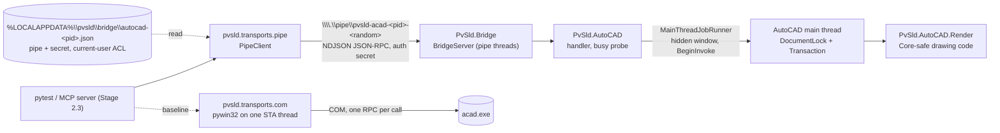

# Spike S2: AutoCAD 2027 Connectivity (.NET 10 Plug-in vs COM)

| Field | Value |
|---|---|
| Stage | Phase 2, Stage 2.2 ([`IMPLEMENTATION_PLAN.md`](../../IMPLEMENTATION_PLAN.md)) |
| Decision under test | [ADR-0001](../decisions/ADR-0001-claude-autocad-integration.md), backend B2 and option O3 (COM baseline) |
| Date | 2026-10-05 |
| Workstation | Windows 11 Pro 26200; AutoCAD 2027 (R26.0, Spanish, **Education licence**); .NET SDK 10.0.401; Python 3.11.9; pywin32 312 |
| Status | Code complete; **AutoCAD benchmark pending** (see [Results](#results)) |

## Summary

Backend B2 is built as ADR-0001 describes:

- A .NET 10 plug-in, NETLOADed into AutoCAD 2027, listens on a current-user named pipe.
- Requests are newline-delimited JSON-RPC 2.0, and each connection authenticates with a secret generated at each start.
- Drawing work runs on AutoCAD's main thread under `DocumentLock` and one `Transaction`.
- A Python client, an in-process fake of the plug-in and a careful pywin32 COM baseline complete the spike.

Everything that does not need AutoCAD is tested in CI. The criteria that need a licensed AutoCAD are automated in `tests/autocad` and run with `scripts/s2_bench.py`.

## Results

> [!NOTE]
> Pending the owner-attended AutoCAD run (the plug-in's trust dialog needs the owner's answer). This section is replaced by the numbers from `build/s2/results.json` (also committed under [`s2-results/`](s2-results/)).

| Stage 2.2 criterion | Measured | Result |
|---|---|---|
| Plug-in ping p95 < 50 ms | pending | pending |
| 200 attributed inserts + 200 lines < 2 s | pending | pending |
| COM / plug-in latency ratio recorded | pending | pending |
| 100/100 consecutive runs without unhandled errors | pending | pending |
| Busy (modal dialog, active command) -> actionable error <= 5 s, AutoCAD never hangs | pending | pending |
| Injected mid-transaction failure leaves the drawing unchanged | pending | pending |
| Client without the secret refused; pipe ACL current user only | pending (verified by unit tests on a real pipe) | pending |

## What was built



| Part | Path | Role |
|---|---|---|
| `PvSld.Bridge` (net10.0) | `plugin/src/PvSld.Bridge/` | AutoCAD-free transport: pipe server, NDJSON reader, JSON-RPC, secret handshake, current-user ACLs, discovery file, main-thread job runner |
| `PvSld.AutoCAD.Render` (net10.0) | `plugin/src/PvSld.AutoCAD.Render/` | Core-safe drawing code (AcCoreMgd and AcDbMgd only): test symbol, attributed inserts, attribute read-back, batch, drawing fingerprint |
| `PvSld.AutoCAD` (net10.0-windows) | `plugin/src/PvSld.AutoCAD/` | Desktop host: starts the bridge on NETLOAD, marshals jobs to the main thread, detects busy states, locks the document, owns the transaction; `PVSLDBRIDGE` prints its status |
| Bridge tests (xUnit) | `plugin/tests/PvSld.Bridge.Tests/` | 43 tests, including a real named pipe: auth refusal, ACLs, error mapping, busy and abandon semantics |
| Python client | `src/pvsld/transports/{protocol,streams,pipe}.py` | Discovery, auth, typed calls, deadlines on every read and write (overlapped I/O on Windows) |
| Fake plug-in | `src/pvsld/transports/fake.py` | Same protocol and semantics over TCP or a pipe; used by CI tests and later by MCP tool tests |
| COM baseline | `src/pvsld/transports/com.py` | Throwaway (ADR-0001 O3); one STA thread, per-call retry of rejected calls, makepy early binding |
| AutoCAD suite | `tests/autocad/`, `scripts/s2_bench.py` | The Stage 2.2 measurements, marked `autocad` |

The plug-in references Autodesk's NuGet packages `AutoCAD.NET`, `AutoCAD.NET.Core` and `AutoCAD.NET.Model` 26.0.0 with `ExcludeAssets=runtime`; no Autodesk binary is copied to `bin/` or committed. Because the reference assemblies come from NuGet, the CI job `plug-in` builds the solution and runs the bridge tests on `windows-latest` without AutoCAD.

## Bridge protocol v1

**Discovery.** On NETLOAD the plug-in writes `%LOCALAPPDATA%\pvsld\bridge\autocad-<pid>.json`. It deletes the file on shutdown, and the client ignores files whose pid is no longer running.

```json
{"protocol": 1, "pipe": "pvsld-acad-1234-3f9a0c1b2d4e", "secret": "<43 chars, 256 bits>",
 "pid": 1234, "server": "pvsld-autocad-bridge 0.2.0", "host_version": "26.0...", "started_utc": "..."}
```

The bridge directory and the file carry a protected DACL with a single allow entry for the current user. The pipe name includes 48 random bits, so another process cannot create it in advance. Before sending the secret, the client checks with `GetNamedPipeServerProcessId` that the pipe is served by the AutoCAD pid in the file.

**Pipe.** The pipe has a protected DACL: deny `NETWORK` (no remote clients, even under the same account) and allow the current user full control. Nothing else is granted. It runs in byte mode, with up to 4 simultaneous connections.

**Framing.** One JSON-RPC 2.0 object per line (UTF-8, `\n`), the framing MCP uses on stdio. Lines over 8 MiB are refused. Batches and notifications are not supported.

**Handshake.** The first request must be `{"method": "auth", "params": {"secret": "..."}}`. Any other first request, a wrong secret, invalid JSON or 5 s of silence returns error -32001 and closes the connection. A successful auth returns `{"server", "version", "protocol", "methods"}`.

**Methods (the allowlist).** No method runs LISP, commands or code.

| Method | Params | Result | Thread |
|---|---|---|---|
| `ping` | `main_thread?: bool` | `pong, pid, host_version, server_version, main_thread, documents?` | pipe thread, or one main-thread hop if `main_thread` |
| `insert_block` | `block, position [x,y(,z)], attributes {TAG: text}, document?` | `handle, attributes, created_block_definition` | main |
| `read_attributes` | exactly one of `handle` / `block`; `document?` | `references: [{handle, block, position, attributes}]` | main |
| `batch` | `block, inserts [{position, attributes}], lines [{start, end}], document?, inject_failure_after?` | `inserted, lines, handles, created_block_definition, main_thread_ms, server_ms` | main, one transaction |
| `drawing_stats` | `document?` | `modelspace_entities, block_definitions, modelspace_digest` | main |

- `document` names an open drawing by file name or full path; without it, the active drawing is used.
- A missing block is created as a simple test symbol: an outline, a circle and the attribute tags `COMP_ID` (hidden), `LABEL` and `RATING`.
- Unknown attribute tags are rejected before anything is written.
- `inject_failure_after: n` is a test hook. The batch throws after `n` entities, before commit. Its only possible effect is a rollback.
- A batch holds at most 5,000 items.

**Errors.**

| Code | Meaning | `data` |
|---|---|---|
| -32700 / -32600 / -32601 / -32602 / -32603 | parse error, invalid request, unknown method, invalid params (the message names the fix), internal error | |
| -32001 | unauthorized; the connection is closed | |
| -32002 | busy; the message says what to do in AutoCAD | `reason` (`modal_dialog`, `command_active`, `not_quiescent`, `document_locked`, `main_thread_unavailable`, `bridge_busy`), `retry_after_ms` |
| -32003 | the operation failed and was rolled back | `rolled_back: true`, `injected` |
| -32004 | started but still running after 60 s; outcome unknown | |
| -32005 | the drawing is not open | |

**Busy semantics.** Jobs run one at a time. A job is posted to AutoCAD's main thread through a hidden window (`Control.BeginInvoke`), so it runs in the application context. There it:

1. refuses work if the main window is disabled (a modal dialog is open), a command is in progress, or AutoCAD is not quiescent (a command, script or LISP is running);
2. locks the document with `promptIfFails: false`, so a lock that would need a prompt fails fast as `document_locked`;
3. runs the body in one transaction and commits only if the body returns.

If the main thread has not started a job within 3 s, the job is marked abandoned and the client gets `main_thread_unavailable`. An abandoned job never runs later, even when AutoCAD becomes idle again. No exception from a job, `Initialize` or `Terminate` reaches AutoCAD's message loop, where it would surface as a blocking dialog.

## How to build, load and run

```powershell
dotnet build plugin/PvSld.AutoCAD.slnx -c Release      # needs the .NET 10 SDK, not AutoCAD
dotnet test  plugin/PvSld.AutoCAD.slnx -c Release --no-build
.venv\Scripts\python -m pytest                          # protocol tests; autocad tests skip
.venv\Scripts\python scripts/s2_bench.py                # full S2 run on the licensed workstation
.venv\Scripts\python scripts/s2_bench.py --quick        # smaller samples
```

To load the plug-in by hand in a running AutoCAD, run `NETLOAD` and choose `plugin\src\PvSld.AutoCAD\bin\Release\net10.0-windows\PvSld.AutoCAD.dll`. `PVSLDBRIDGE` prints the pipe name and counters. The DLL is unsigned and its folder is not trusted, so with `SECURELOAD=1` AutoCAD asks *Seguridad - Archivo ejecutable no firmado* each session. **Cargar una vez** loads it for that session only. The spike never changes `SECURELOAD`, `TRUSTEDPATHS` or the autoload folders. ADR-0001 plans a signed `.bundle` in a trusted path for real use.

## Safety rules for driving AutoCAD (and why)

On the first attempt, the spike force-killed an AutoCAD instance it had started while that instance was still starting. AutoCAD was writing `AcLivePreviewContext.dll` into the user profile at that moment and the file was left truncated. Every later start then showed an unhandled-exception dialog, "Bad IL format", from `PreviewContextService.LoadContext` on the first Idle event. Only the owner repairs files in their profile; the spike never touches it. Since then the harness enforces these rules in code (`pvsld.transports.com` and `tests/autocad/conftest.py`):

- **Never force-kill AutoCAD.** Shut down only by closing this process's drawings without saving and calling `Quit()`. If AutoCAD does not exit within 120 s, leave it running and report it.
- After `DispatchEx`, wait for `GetAcadState().IsQuiescent` (budget at least 180 s). Rejected calls and pywin32's bare `AttributeError` for a rejected name lookup count as "still starting".
- Start one instance per session. Never relaunch while an instance may still be starting. Never drive an AutoCAD that was already running.
- Abort before any test work if the new instance shows a known start-up failure (`Bad IL format`), then ask it to `Quit()`.
- Leave the trust dialog to the owner. Never change AutoCAD security settings.
- Work only in drawings the run created, and close them without saving.

## Findings so far

- **NuGet reference assemblies exist for 2027.** `AutoCAD.NET`, `.Core` and `.Model` 26.0.0 (net10.0) ship XML docs and build without AutoCAD, so the plug-in can be built in CI.
- **SECURELOAD blocks unattended loading.** With `SECURELOAD=1` and an empty `TRUSTEDPATHS`, NETLOAD of an unsigned DLL from a build folder always prompts. Unattended use therefore needs a signed `.bundle` in a trusted location, as ADR-0001 already planned. It is a deployment cost of B2, not a technical blocker.
- **The workstation runs an Education licence** ("EDUCACIÓN (NO COMERCIAL)" in the title bar). That is fine for this spike. Drawings produced with it carry the educational stamp, so commercial submissions need a commercial licence.
- **pywin32 cannot register an `IMessageFilter`** (build 312 lacks `CoRegisterMessageFilter`). The COM baseline applies the same retry policy per call instead.
- **Dynamic dispatch hides busy rejections.** pywin32's dynamic dispatch turns a rejected `GetIDsOfNames` into a bare `AttributeError`, indistinguishable from a typo. That is one more reason the baseline uses makepy early binding after start-up.
- **AutoCAD start-up via COM took 33 to 59 s** on this workstation. One `DispatchEx` failed with `CO_E_SERVER_EXEC_FAILURE` while an earlier instance was still shutting down, which is why the one-instance rule exists.

## Reproducing and extending

- The plug-in's methods are spike-level. ADR-0001's allowlist for production is `render_diagram`, `read_back`, `save_as_dwg`, `plot_pdf` and `zoom_to`, and the S1 diagram model will replace the test symbol.
- The fake plug-in (`pvsld.transports.fake.FakeBridgeServer`) is the reference for the protocol in Python tests, including Stage 2.3's MCP tools.
- The vault note `wiki/sources/Spike S2 Results 2026-10.md` holds the same results with links to the research notes.
